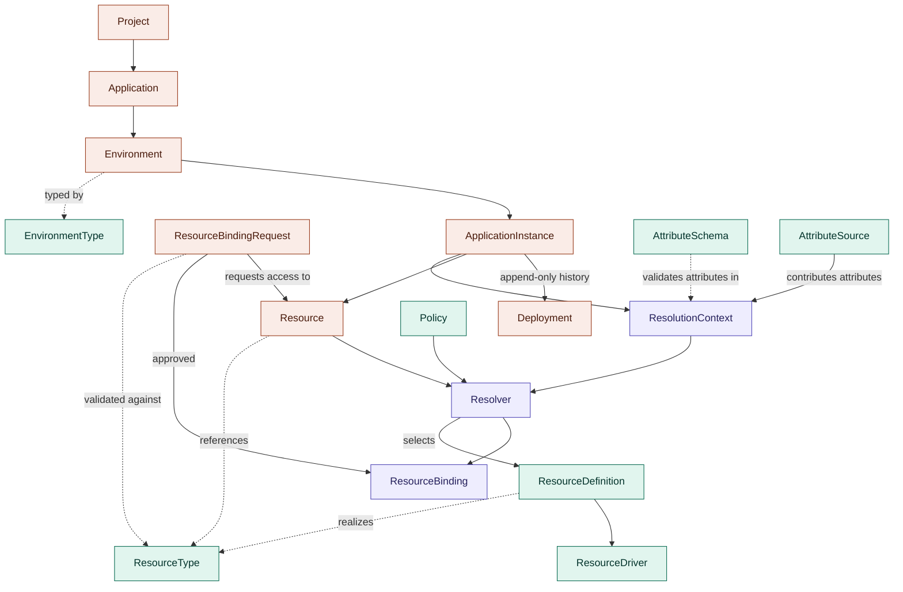

| | |
|---|---|
| **Status** | Draft for review |
| **Series** | RFC-001 (this document) · [RFC-002: The SCORE Profile](rfc-002-score-profile.md) · [RFC-003: Resolution & the Attribute Model](rfc-003-resolution-and-attribute-model.md) · RFC-004 Identity (future) · RFC-005 Explainability API (future) · RFC-006 VCS Events & Ephemeral Lifecycle (future) |
| **Scope** | Domain model, ownership boundaries, and structural semantics of an open-source platform controller (alternative to the Humanitec Platform Orchestrator) |
| **Intent source** | [SCORE](https://score.dev) workload specifications (interpretation specified in RFC-002) |
| **Date** | 2026-08-03 · revised 2026-08-04 · split into series 2026-08-04 |

> **Series conventions.** Rule numbers (R1–R13) and caveat numbers (C1–C6) are **global across the series** — a rule keeps its number regardless of which document it lives in, so cross-references never break. R1–R2 and C1/C6 live in RFC-002; R7, R8, R12, R13 live in RFC-003; everything else is here. This document also holds the series-wide **decision log**: rejected ideas (§8), parked concepts (§9), and open questions (§10).

---

## 1. Purpose

This RFC defines the domain model for an open-source platform controller: the entities, the relationships between them, and — critically — the ownership boundaries between three parties:

1. **The controller** (this project): provides *mechanism* — matching, resolution, reconciliation, provisioning orchestration, and explainability.
2. **The platform team**: operates a Platform Instance and provides *meaning* — organizational vocabulary, policies, resource definitions, and provisioning wiring.
3. **The application team**: expresses *intent* — SCORE workload specifications and resource declarations in the organization's vocabulary.

Every entity in this model is assigned to exactly one of these parties for authorship, and every rule in this series can be traced to the principle that the controller must never embed organizational semantics.

## 2. Design principles

These are carried over from the ideation phase and are the acceptance criteria for every decision in the series.

1. **Separate mechanism from meaning.** The controller provides matching, resolution, reconciliation, provisioning orchestration, and explainability. Organizations define vocabulary, attributes, policies, implementations, and provisioning logic.
2. **Intent before infrastructure.** Applications express intent; organizations define how intent maps onto infrastructure; infrastructure details remain implementation details.
3. **Explainability is a first-class concern.** Every resolution outcome — success, failure, pending — must be traceable: why an implementation matched, why others did not, which constraints conflicted, and what context was used.
4. **Constraint solving over inheritance.** Resolution is attribute/constraint-based, not hierarchy-based. Provisioning is a separate, downstream concern: the resolver never invents infrastructure.
5. **Order independence.** The system is level-triggered and reconciling. No rule may depend on the order in which objects are applied (see rule R3).

## 3. Domain model overview

**Legend**: coral = app team (intent) · purple = controller (mechanism) · teal = platform team (meaning). `ResourceType`, `AttributeSchema`, and `EnvironmentType` together constitute the **Organization Vocabulary** (a layer, not an object — see glossary).

Solid arrows are **flow relationships** (data or lifecycle flows through them at runtime). Dashed arrows are **reference relationships** (one entity names or is validated against another).

## 4. Glossary

The glossary is the shared vocabulary of the whole series; sibling RFCs reference it rather than redefining entities.

Entities are listed with their **kind** — *aggregate* (a persisted object, e.g. a CRD) or *value object* (a named, schema'd concept that is computed rather than stored) — and their **owning party**.

| Entity | Kind | Owned by | Definition |
|---|---|---|---|
| **Project** | Aggregate | App team | A grouping of Applications under one common product initiative and the **organization-wide naming scope**: every Application belongs to exactly one Project (via `metadata.project`, defaulting to the controller-shipped `default` Project) and all identifiers are project-qualified (R2, RFC-002). Remains the future anchor for identity (team ownership) and an additional policy scope (§9). |
| **Application** | Aggregate | App team | The environment-independent intent: a single SCORE workload specification plus application-level metadata. Belongs to exactly one Project via `metadata.project` (R2). Declares resources abstractly; nothing is provisioned from an Application alone. One Application corresponds to exactly one SCORE workload (see rejected ideas §8). |
| **Environment** | Aggregate | App team | An application-scoped, named deployment space (e.g. `pr-123`, `staging`, `production`) carrying an **EnvironmentType** drawn from the Organization Vocabulary. Environments are not organization-level objects and carry no infrastructure attributes such as region (see caveat C4). |
| **EnvironmentType** | Aggregate (vocabulary entry) | Platform team (defaults shipped by controller) | A category of environment used as the stable hook for policy scoping and cross-environment rules. The controller ships four standard defaults — `ephemeral`, `development`, `staging`, `production` — and the vocabulary may extend the set. `ephemeral` additionally implies lifecycle semantics (TTL / auto-teardown) that the controller mechanism must support. Each entry declares two mechanical properties: **`defaultReferenceTarget`** — which EnvironmentType its references resolve to, defaulting to *self*; the shipped `ephemeral` entry targets `development` (R8, R12, RFC-003) — and **`teardownSemantics`** (`blocking` \| `eager`, see R6; shipped `eager` for `ephemeral`, `blocking` otherwise). |
| **ApplicationInstance** | Aggregate | App team (created by the act of deploying) | The materialization of an Application in one of its Environments: `Application × Environment`. ApplicationInstances — not Applications — are the owners of Resources; the same SCORE declaration materializes a **separate** Resource per environment. |
| **Deployment** | Aggregate | App team (triggered); Controller (status) | An append-only record of applying a specific Application revision to an Environment. Carries a status (`in-progress`, `succeeded`, `failed`). The current state of an ApplicationInstance is defined by its **latest successful Deployment**; Resources belong to the ApplicationInstance, never to a Deployment. Rollback is expressed as a *new* Deployment of a previously good revision (see R11). |
| **Resource** | Aggregate | App team (owner instance declares); Controller (status) | A platform-managed resource requested by an owning ApplicationInstance via its SCORE spec. Carries the owner's intent (type, class, params, requested accesses) in spec, and controller-written ownership, canonical identity, and provisioning state in status. Interpretation of the SCORE declaration is specified in RFC-002 (R1). |
| **ResourceBindingRequest (RBR)** | Aggregate | App team (requesting instance); approval per policy | A request by an ApplicationInstance for access (one or more named access relationships) to a Resource. Always created — including by the owner, whose requests auto-approve — so that every access grant shares one lifecycle, one audit trail, and one revocation path. |
| **ResourceBinding** | Aggregate | Controller (synthesized; never user-authored) | The materialized outcome of an approved RBR: exactly one per (ApplicationInstance, Resource) pair, containing only the accesses that instance was granted, with credential/connection material per access and a lifecycle state. |
| **ResourceType** | Aggregate (vocabulary entry); schema controller-owned | Platform team | An abstract service kind in the organization's vocabulary (`postgres`, `queue`, `feature-flags`, …). Declares its legal `class` values, a parameter schema (including access-configuration shapes under the well-known `access` params key, see R1, RFC-002), an **outputs schema** (optionally refined per class), and the **access vocabulary**: the closed set of access relationship names (e.g. `runtime`, `migration`, `readonly`, `replication`, `admin`), each mapped to the subset of output keys it unlocks (R7, RFC-003). |
| **AttributeSchema** | Aggregate (vocabulary entry) | Platform team | Declares attribute keys, value types/enums, and the scopes each key may appear on (environment, instance, resource params, matching criteria). Enforced at admission: unknown attribute keys are rejected with an explainable error rather than silently never matching. Realized as its own CRD; each object may declare a group of related keys (Q4). |
| **AttributeSource** | Aggregate / extension point | Platform team (registered); Controller (contract + built-ins) | A registered producer of ResolutionContext attributes. Its registration declares the attribute keys it may emit, admission-validated against AttributeSchemas. Built-ins (environment attributes, instance identity, resource params/accesses) are controller-shipped sources under the same contract; the future deployment-target (§9) plugs in as another registration. See R13 (RFC-003). |
| **Organization Vocabulary** | Layer (not a single object) | Platform team | The union of ResourceTypes, AttributeSchemas, and EnvironmentTypes. The controller validates all authored objects against it at admission. |
| **ResourceDefinition** | Aggregate | Platform team | The organization-registered matching unit (Humanitec-aligned naming): declares which ResourceType it realizes, its matching criteria over the ResolutionContext, its configuration, the **subset of the type's access vocabulary it supports**, and the ResourceDriver it delegates to. |
| **ResourceDriver** | Aggregate / extension point | Platform team (registered); Controller (contract) | The executor a ResourceDefinition delegates realization to: Crossplane, Terraform, a bespoke API, etc. This is the designated escape hatch for custom provisioning and externally managed resources. |
| **Policy** | Aggregate | Platform team | Organizational rules that constrain resolution and lifecycle: per-EnvironmentType access coverage requirements, approval automation for RBRs, cross-environment-type sharing overrides, and general matching constraints. |
| **Resolver** | Domain service | Controller | Selects a ResourceDefinition for a Resource by constraint-matching over the ResolutionContext, subject to Policies. Never invents infrastructure. Emits a full explainability trace for every outcome. Specified in RFC-003. |
| **ResolutionContext** | Value object | Controller (computed) | The input tuple assembled per resolution: EnvironmentType + environment attributes + application/instance **identity** (names — never metadata, see C6, RFC-002) + the Resource's type, class, params, and requested accesses. Assembled **exclusively** from registered AttributeSources (R13, RFC-003); Policies are applied *over* the context by the Resolver, never contributed *into* it. Not stored as an object, but its schema is documented and every resolution trace serializes the exact context used, with per-attribute source provenance. |

## 5. Ownership legend

For each entity: who defines the **schema** (the shape of the object), who **authors instances**, who **writes status**, and who controls **deletion/lifecycle**.

| Entity | Schema | Instances authored by | Status written by | Lifecycle controlled by |
|---|---|---|---|---|
| Project | Controller | App team | Controller | App team |
| Application | Controller (SCORE profile, see C1, RFC-002) | App team | Controller | App team |
| Environment | Controller | App team | Controller | App team (ephemeral: controller TTL) |
| EnvironmentType | Controller | Controller (defaults) + Platform team (extensions) | — | Platform team |
| ApplicationInstance | Controller | Created by deployment (app team action) | Controller | App team deploy/undeploy; controller GC |
| Deployment | Controller | Created by app-team deploy action | Controller only | Append-only; never mutated or deleted while its instance exists |
| Resource | Controller | Owning ApplicationInstance (via SCORE) | Controller only | Controller (finalizers, see R6) |
| ResourceBindingRequest | Controller | Requesting ApplicationInstance | Controller | Requester (withdraw) / owner or policy (revoke) |
| ResourceBinding | Controller | **Controller only** — never user-authored | Controller | Controller (follows RBR) |
| ResourceType | Controller | Platform team | Controller | Platform team |
| AttributeSchema | Controller | Platform team | Controller | Platform team |
| AttributeSource | Controller (contract) | Controller (built-ins) + Platform team (registrations) | Controller | Platform team |
| ResourceDefinition | Controller | Platform team | Controller | Platform team |
| ResourceDriver | Controller (contract) | Platform team | Controller | Platform team |
| Policy | Controller | Platform team | Controller | Platform team |
| ResolutionContext | Controller (documented value-object schema) | — (computed) | — | — (ephemeral; persisted only inside traces) |

The pattern to internalize: **the controller owns every schema; it authors almost no instances.** The single exception is ResourceBinding, which only the controller may create — that asymmetry is what makes bindings trustworthy as an audit surface.

## 6. Structural rules

> SCORE-facing rules R1–R2 live in RFC-002; resolution rules R7, R8, R12, R13 live in RFC-003. Numbering is global.

### R3 — Missing references are *pending*, never errors

**This rule is an explicit design rationale, not an implementation detail.** In a level-triggered reconciling system, deployment order is not guaranteed. If a consumer instance is deployed before the owner of the resource it references, its RBR enters `Pending: referenced resource does not exist` and resolves automatically when the owner arrives. Hard-failing on ordering would force platform teams into deploy-sequencing — precisely the kind of infrastructure detail that principle 2 forbids applications from carrying. The only hard error in the reference path is the R1 schema rejection (params on a reference outside the type's access-configuration schema; RFC-002).

### R4 — Protected ownership marker

Ownership is recorded where only the controller can write:

- The Resource's **status subresource** carries `ownerInstanceRef` (RBAC on status is naturally separable from spec).
- A Kubernetes `ownerReference` to the owning ApplicationInstance object provides garbage-collection semantics for free.
- A ValidatingAdmissionPolicy rejects mutation of ownership-bearing fields by any principal other than the controller's service account.

Nothing is authored, nothing can be tampered with, and every ownership fact is auditable.

### R5 — ResourceBindingRequests are universal

Every access grant — including the owner's own — flows through an RBR. The asymmetry lives in **approval**, not existence: owner requests auto-approve; consumer requests are subject to approval policy (which may automate approval, e.g. within the same team or for `development`-type environments). Benefits: one reconciliation loop, one uniform audit trail, one revocation path (delete the RBR, the binding follows).

### R6 — Deletion semantics and blast radius

A Resource with active consumer bindings **blocks deletion** (finalizer semantics) rather than cascading. The one exception is vocabulary-declared, not hardcoded: if the *owning* environment's EnvironmentType declares `teardownSemantics: eager` (the shipped default for `ephemeral`), TTL/teardown deletion proceeds — surviving consumer bindings are force-revoked, and the revocation is recorded explainably on both the deleted resource's trace and each affected consumer, so the audit trail survives even when the resource does not. The blockage is surfaced through the explainability API. Because every access grant is an RBR→ResourceBinding pair, "what breaks if I delete this Resource" is a graph query over its bindings — the same data the explainability surface already holds, rendered as a dependency ("blast radius") view. A UI showcasing all affected systems is an explicit roadmap item built on this query.

### R9 — Vocabulary enforcement at admission

All authored objects are validated against the Organization Vocabulary at admission time. An unknown attribute key, access name, or resource type is an immediate, explainable rejection — never a constraint that silently fails to match at resolution time. (R13, RFC-003, extends this to runtime-sourced attributes via AttributeSource registration.)

### R10 — Explainability trace contents

Every resolution outcome (matched, excluded, pending, rejected) records: the serialized ResolutionContext used (with per-attribute source provenance, per R13), all candidate ResourceDefinitions with per-candidate match/exclusion reasons, the Policies applied, and the final selection or failure. Traces are the substrate for both debugging and the R6 blast-radius view.

### R11 — Deployments, instance state, and rollback

A **Deployment** is the append-only record of applying one Application revision to one Environment; the ApplicationInstance's current state is always its **latest successful Deployment**. This yields rollback for free — with three deliberate semantics:

- **Rollback is roll-forward.** Rolling back means creating a *new* Deployment from a previously known-good revision, not mutating or deleting history. The Deployment log stays a truthful audit trail.
- **Rollback reverts intent, not resource state.** A Deployment may add or remove resource declarations: additions trigger provisioning; removals trigger deletion *subject to R6 finalizers* (active consumer bindings still block). Rolling back a revision that altered a database's declared params reverts the *declaration* — it does not time-travel the database's contents. Stateful recovery is a ResourceDriver/organizational concern, never a controller promise.
- **Failed Deployments never dangle.** A failed Deployment leaves the instance's state at the previous successful Deployment; the failure and its causes (including resolution failures, per R10) are recorded on the Deployment status, making "auto-rollback on failure" a Policy-expressible behavior rather than a hardcoded one.

## 7. Caveats (structural)

> SCORE-profile caveats C1 and C6 live in RFC-002.

**C2 — ResourceType has dual ownership.** The controller owns the *schema* (what fields a ResourceType has: name, parameter schema, access vocabulary); the platform team owns the *instances* (`postgres`, `queue`, …). This is principle 1 applied to the vocabulary itself, and the same duality applies to every platform-team entity in §5.

**C3 — "ApplicationInstance" is not a Humanitec term.** See the terminology mapping in RFC-002. The concept aligns; the word does not. Documented to preempt terminology debates.

**C4 — Region is context, not environment.** An Environment deliberately carries no infrastructure attributes. A production environment may span regions; region-like attributes enter the ResolutionContext from a runtime/deployment-target AttributeSource that is *not yet modeled* (see §9 and R13, RFC-003). Putting region on Environment was considered and rejected as smuggling infrastructure back into the intent layer.

**C5 — EnvironmentType defaults are conventions, not mechanism.** The controller ships `ephemeral` / `development` / `staging` / `production` as standard defaults to keep policies portable across organizations, but the set is vocabulary-extensible. Hardcoding the enum would violate principle 1. The one mechanical commitment is that `ephemeral` lifecycle semantics (TTL, auto-teardown) are supported by the controller. **Current proposal**: an ephemeral environment spins up on PR open against the source repository and tears down on PR close or merge — details to be defined (see Q6), and note this implies a source-control event source (§9). `ephemeral`'s reference-target and teardown behaviors are likewise vocabulary properties on the EnvironmentType entry, not hardcoded mechanism (R6; R8/R12, RFC-003).

## 8. Rejected ideas (series-wide decision log)

Carried forward from ideation and extended with decisions made during this design phase. Each rejection is a load-bearing part of the model.

| Rejected idea | Reason |
|---|---|
| Platform understands business meaning of arbitrary attributes | Violates mechanism/meaning separation. Meaning lives in the Organization Vocabulary. |
| Resolver invents infrastructure when no implementation exists | Resolution selects among *registered* ResourceDefinitions only. Provisioning occurs strictly after selection. |
| Single universal interface for complex services (e.g. databases) | Replaced by the relationship model: access vocabularies on ResourceTypes, supported subsets on ResourceDefinitions, bindings per instance. |
| Deep organizational inheritance as the primary resolution mechanism | Inheritance ambiguity and exception handling scale poorly. Replaced by attribute/constraint matching over ResolutionContext. |
| Capability as the central application-facing abstraction | Became overloaded and interface-like; could not model complex resources. Superseded by ResourceType + Binding. |
| Organization-level Environment objects | Environments are application-scoped. Org-level environments forced unrelated applications to share configuration objects and invited infrastructure attributes into intent. |
| Region (or other infrastructure attributes) on Environment | See C4. |
| Skipping the RBR for the owning instance | Would create two code paths and an audit gap. Superseded by R5 (universal RBRs, asymmetric approval). |
| Owner-chosen resource `id` | Would destroy the R1 presence signal. Superseded by deterministic ids + human alias (R2, RFC-002). |
| Hard-failing when a referenced resource does not exist yet | Would make deployment order load-bearing. Superseded by R3 (pending states). |
| Requiring every ResourceDefinition to cover the full access vocabulary | Excludes legitimate lightweight implementations. Coverage requirements are Policy, not mechanism (R7, RFC-003). |
| One binding per access relationship | Multiplied objects with no functional gain given bindings are a controller-synthesized output surface. One ResourceBinding per (instance, resource) pair; per-access credential material lives inside it. |
| Grouping multiple SCORE workloads under one Application | Kept 1:1 for simplicity (also matches Humanitec). Cross-application grouping is provided by **Project** instead. |
| Cascade-deleting Resources with active consumer bindings | Silent blast radius. Superseded by R6 (blocking finalizers + dependency view; vocabulary-declared eager exception for ephemeral). |
| Rejecting all `params` on `id`-set resource entries (earlier R1) | Reversed 2026-08-04: references need params to configure access (well-known `access` key, R1, RFC-002). The guard against consumers reshaping owned resources moved from syntax to schema validation. |
| Embedding environment, `type`, or `class` into the canonical id string | Breaks SCORE's environment-agnostic resources contract and duplicates already-declared fields. Identity is the upstream (type, class, id) triple; the environment dimension is controller-resolved (R2, RFC-002; R12, RFC-003). |
| Random, environment-salted globally-unique canonical ids | Explored and rejected 2026-08-04. Makes every (type, class, id) triple unambiguous, but a pinned id in an environment-agnostic consumer file binds *all* of the consumer's environments to one concrete resource — forcing environment-specific file variants, exactly what the resources section exists to avoid. Also destroys id predictability (R2) and stability across resource recreation. Cross-environment referencing stays parked (Q7). |
| Declarable precedence between conflicting AttributeSources (v1) | Conflicts are explainable errors (R13, RFC-003). Precedence is a sharp tool deferred until demanded: relaxing an error later is easy; retracting a shipped precedence feature is not. |
| Project membership via an `applications` list on the Project spec | Shared-object write contention, a dual-membership conflict class (two Projects listing one Application), and non-self-contained identity: the Application's id (`<project>.<app>`) would be determined by a *different* object and silently change with Project edits. Membership is a property of the member: `metadata.project` (R2, RFC-002). |

## 9. Not yet modeled

These concepts are consciously **parked, not unresolved** — each has a designated shape it will take when opened.

**Identity (teams, principals, ownership of Projects).** Referenced by three settled mechanisms that currently point at a hole: RBR approval ("owners of the workload"), environment instantiation rights ("who may deploy Application X into a production-type environment"), and Project ownership. Decision: these will be folded into **one** identity model rather than several ad-hoc ones — the subject of **RFC-004**. Project is the designated anchor (teams own Projects; Applications inherit), now strengthened by Project's role as the naming scope (R2, RFC-002).

**Runtime / deployment target.** The source of infrastructure-flavored context attributes (region, cluster, cloud). The AttributeSource contract (R13, RFC-003) defines exactly how it will plug in — one more registration, no model reshaping. Humanitec's equivalent concept confirms the slot exists.

**Source-control event source.** The ephemeral-environment proposal (C5/Q6) requires the controller to react to VCS events (PR open/close/merge) — the subject of **RFC-006**. Like the runtime target, this enters through a defined integration point rather than reshaping the domain model.

## 10. Open questions (series-wide decision log)

| # | Question | Current lean |
|---|---|---|
| Q1 | Who may instantiate: which principals can deploy an Application into an Environment of a given type? | Deferred to the identity model (§9 / RFC-004); enforced via Policy over (team × EnvironmentType). |
| Q2 | *(Resolved 2026-08-04.)* Runtime attributes enter via a registered **AttributeSource** (R13, RFC-003): registration-declared emissions validated against AttributeSchemas, conflicts as explainable errors (no v1 precedence), per-attribute provenance in traces. | The deployment-target concept itself stays parked (§9) and will arrive as one more registration. |
| Q3 | *(Resolved 2026-08-04.)* `class`, `id`, `params`, and outputs are settled in R1, R2 (RFC-002) and R7, R12 (RFC-003). Metadata is settled in C6 (RFC-002): no SCORE `metadata` ever enters the ResolutionContext; matching inputs are validated attributes, identity, and params only; controller-interpreted metadata is limited to two explicit exceptions. | `containers`, `service`, and `apiVersion` pinning stay SCORE-owned and opaque to the domain model (handed to the workload runtime, see Q2). |
| Q4 | *(Resolved 2026-08-04.)* AttributeSchema is its **own CRD**; each object may declare a small group of related attribute keys. No monolithic registry object: symmetry with the other vocabulary aggregates, per-domain ownership/RBAC/GitOps granularity, and no unbounded singleton growth toward etcd limits. | Admission enforcement (R9) is served from an informer cache either way; grouping of keys per object is the platform team's call, not mechanism. |
| Q5 | Exact shape of the explainability API (query surface, trace retention, blast-radius rendering). | Traces per R10; API design is **RFC-005**. |
| Q6 | *(Half resolved 2026-08-04: teardown-vs-finalizers settled via `teardownSemantics` on EnvironmentType — `eager` for `ephemeral`, R6 — and ephemeral references default to `development` via `defaultReferenceTarget`, R8/R12, RFC-003.)* Remaining: VCS-event mechanics — spin up on PR open, tear down on PR close/merge, TTL fallback ordering. | Requires the source-control event source from §9 (C5); the subject of **RFC-006**. |
| Q7 | Enabling cross-EnvironmentType references: the exact Policy shape for cross-type mappings, and disambiguation when an owner has multiple environments of the matching type (R12, RFC-003). | Parked 2026-08-04: for now, referencing another application's resource requires the requester's type's `defaultReferenceTarget` (R12). Random globally-unique ids were explored and rejected (§8). |
| Q8 | Standalone resource ownership: a team may own a resource (e.g. a shared database) independently of any application, but ownership, RBR auto-approval, and lifecycle are all currently anchored on an owning ApplicationInstance — and SCORE itself cannot express a container-less, resource-only workload (`containers` is required). | Likely a first-class resource-only intent object rather than a stub Application — owned by a Project/team once the identity model lands (RFC-004). The project-qualified id scheme (R2, RFC-002) already accommodates it: `<project>.<resource-key>`, no application segment. |

## 11. Areas worth further investigation

Carried from ideation, still current: SCORE resource model and extension mechanisms (now specified in RFC-002); Humanitec Resource Definitions and Drivers (as prior art for the RFC-002 terminology alignment); Crossplane as a realization layer behind ResourceDriver; explainable resolution APIs (Q5 / RFC-005); relationship-oriented modeling — which this series has adopted as the core stance via Bindings.
