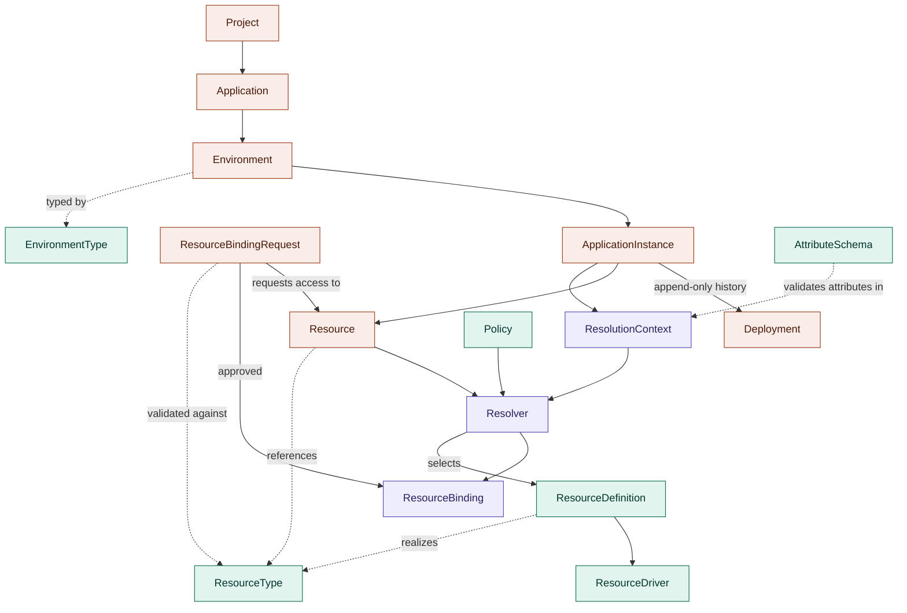

| | |
|---|---|
| **Status** | Draft for review |
| **Scope** | Domain model, ownership boundaries, and core semantics of an open-source platform controller (alternative to the Humanitec Platform Orchestrator) |
| **Intent source** | [SCORE](https://score.dev) workload specifications |
| **Date** | 2026-08-03 |

---

## 1. Purpose

This RFC defines the initial domain model for an open-source platform controller: the entities, the relationships between them, and — critically — the ownership boundaries between three parties:

1. **The controller** (this project): provides *mechanism* — matching, resolution, reconciliation, provisioning orchestration, and explainability.
2. **The platform team**: operates a Platform Instance and provides *meaning* — organizational vocabulary, policies, resource definitions, and provisioning wiring.
3. **The application team**: expresses *intent* — SCORE workload specifications and resource declarations in the organization's vocabulary.

Every entity in this model is assigned to exactly one of these parties for authorship, and every rule in this document can be traced to the principle that the controller must never embed organizational semantics.

## 2. Design principles

These are carried over from the ideation phase and were used as acceptance criteria for every decision below.

1. **Separate mechanism from meaning.** The controller provides matching, resolution, reconciliation, provisioning orchestration, and explainability. Organizations define vocabulary, attributes, policies, implementations, and provisioning logic.
2. **Intent before infrastructure.** Applications express intent; organizations define how intent maps onto infrastructure; infrastructure details remain implementation details.
3. **Explainability is a first-class concern.** Every resolution outcome — success, failure, pending — must be traceable: why an implementation matched, why others did not, which constraints conflicted, and what context was used.
4. **Constraint solving over inheritance.** Resolution is attribute/constraint-based, not hierarchy-based. Provisioning is a separate, downstream concern: the resolver never invents infrastructure.
5. **Order independence.** The system is level-triggered and reconciling. No rule may depend on the order in which objects are applied (see rule R3).

## 3. Domain model overview

**Legend**: coral = app team (intent) · purple = controller (mechanism) · teal = platform team (meaning). `ResourceType`, `AttributeSchema`, and `EnvironmentType` together constitute the **Organization Vocabulary** (a layer, not an object — see glossary).

Solid arrows are **flow relationships** (data or lifecycle flows through them at runtime). Dashed arrows are **reference relationships** (one entity names or is validated against another).

## 4. Glossary

Entities are listed with their **kind** — *aggregate* (a persisted object, e.g. a CRD) or *value object* (a named, schema'd concept that is computed rather than stored) — and their **owning party**.

| Entity | Kind | Owned by | Definition |
|---|---|---|---|
| **Project** | Aggregate | App team | A grouping of Applications under one common product initiative. Deliberately thin in v1; identified as the future anchor for identity (team ownership) and an additional policy scope. |
| **Application** | Aggregate | App team | The environment-independent intent: a single SCORE workload specification plus application-level metadata. Declares resources abstractly; nothing is provisioned from an Application alone. One Application corresponds to exactly one SCORE workload (see rejected ideas §9). |
| **Environment** | Aggregate | App team | An application-scoped, named deployment space (e.g. `pr-123`, `staging`, `production`) carrying an **EnvironmentType** drawn from the Organization Vocabulary. Environments are not organization-level objects and carry no infrastructure attributes such as region (see §8, caveat C4). |
| **EnvironmentType** | Aggregate (vocabulary entry) | Platform team (defaults shipped by controller) | A category of environment used as the stable hook for policy scoping and cross-environment rules. The controller ships four standard defaults — `ephemeral`, `development`, `staging`, `production` — and the vocabulary may extend the set. `ephemeral` additionally implies lifecycle semantics (TTL / auto-teardown) that the controller mechanism must support. |
| **ApplicationInstance** | Aggregate | App team (created by the act of deploying) | The materialization of an Application in one of its Environments: `Application × Environment`. ApplicationInstances — not Applications — are the owners of Resources; the same SCORE declaration materializes a **separate** Resource per environment. |
| **Deployment** | Aggregate | App team (triggered); Controller (status) | An append-only record of applying a specific Application revision to an Environment. Carries a status (`in-progress`, `succeeded`, `failed`). The current state of an ApplicationInstance is defined by its **latest successful Deployment**; Resources belong to the ApplicationInstance, never to a Deployment. Rollback is expressed as a *new* Deployment of a previously good revision (see R11). |
| **Resource** | Aggregate | App team (owner instance declares); Controller (status) | A platform-managed resource requested by an owning ApplicationInstance via its SCORE spec. Carries the owner's intent (type, params, requested accesses) in spec, and controller-written ownership, canonical id, and provisioning state in status. |
| **ResourceBindingRequest (RBR)** | Aggregate | App team (requesting instance); approval per policy | A request by an ApplicationInstance for access (one or more named access relationships) to a Resource. Always created — including by the owner, whose requests auto-approve — so that every access grant shares one lifecycle, one audit trail, and one revocation path. |
| **ResourceBinding** | Aggregate | Controller (synthesized; never user-authored) | The materialized outcome of an approved RBR: exactly one per (ApplicationInstance, Resource) pair, containing only the accesses that instance was granted, with credential/connection material per access and a lifecycle state. |
| **ResourceType** | Aggregate (vocabulary entry); schema controller-owned | Platform team | An abstract service kind in the organization's vocabulary (`postgres`, `queue`, `feature-flags`, …). Declares a parameter schema and the **access vocabulary**: the closed set of access relationship names (e.g. `runtime`, `migration`, `readonly`, `replication`, `admin`) and their credential/connection schemas. |
| **AttributeSchema** | Aggregate (vocabulary entry) | Platform team | Declares attribute keys, value types/enums, and the scopes each key may appear on (environment, instance, resource params, matching criteria). Enforced at admission: unknown attribute keys are rejected with an explainable error rather than silently never matching. |
| **Organization Vocabulary** | Layer (not a single object) | Platform team | The union of ResourceTypes, AttributeSchemas, and EnvironmentTypes. The controller validates all authored objects against it at admission. |
| **ResourceDefinition** | Aggregate | Platform team | The organization-registered matching unit (Humanitec-aligned naming): declares which ResourceType it realizes, its matching criteria over the ResolutionContext, its configuration, the **subset of the type's access vocabulary it supports**, and the ResourceDriver it delegates to. |
| **ResourceDriver** | Aggregate / extension point | Platform team (registered); Controller (contract) | The executor a ResourceDefinition delegates realization to: Crossplane, Terraform, a bespoke API, etc. This is the designated escape hatch for custom provisioning and externally managed resources. |
| **Policy** | Aggregate | Platform team | Organizational rules that constrain resolution and lifecycle: per-EnvironmentType access coverage requirements, approval automation for RBRs, cross-environment-type sharing overrides, and general matching constraints. |
| **Resolver** | Domain service | Controller | Selects a ResourceDefinition for a Resource by constraint-matching over the ResolutionContext, subject to Policies. Never invents infrastructure. Emits a full explainability trace for every outcome. |
| **ResolutionContext** | Value object | Controller (computed) | The input tuple assembled per resolution: EnvironmentType + environment attributes + Application/Instance metadata + the Resource's params and requested accesses + policy inputs. Not stored as an object, but its schema is documented and every resolution trace serializes the exact context used. Attribute sources are pluggable (see open question Q2). |

## 5. Ownership legend

For each entity: who defines the **schema** (the shape of the object), who **authors instances**, who **writes status**, and who controls **deletion/lifecycle**.

| Entity | Schema | Instances authored by | Status written by | Lifecycle controlled by |
|---|---|---|---|---|
| Project | Controller | App team | Controller | App team |
| Application | Controller (SCORE profile, see C1) | App team | Controller | App team |
| Environment | Controller | App team | Controller | App team (ephemeral: controller TTL) |
| EnvironmentType | Controller | Controller (defaults) + Platform team (extensions) | — | Platform team |
| ApplicationInstance | Controller | Created by deployment (app team action) | Controller | App team deploy/undeploy; controller GC |
| Deployment | Controller | Created by app-team deploy action | Controller only | Append-only; never mutated or deleted while its instance exists |
| Resource | Controller | Owning ApplicationInstance (via SCORE) | Controller only | Controller (finalizers, see R6) |
| ResourceBindingRequest | Controller | Requesting ApplicationInstance | Controller | Requester (withdraw) / owner or policy (revoke) |
| ResourceBinding | Controller | **Controller only** — never user-authored | Controller | Controller (follows RBR) |
| ResourceType | Controller | Platform team | Controller | Platform team |
| AttributeSchema | Controller | Platform team | Controller | Platform team |
| ResourceDefinition | Controller | Platform team | Controller | Platform team |
| ResourceDriver | Controller (contract) | Platform team | Controller | Platform team |
| Policy | Controller | Platform team | Controller | Platform team |
| ResolutionContext | Controller (documented value-object schema) | — (computed) | — | — (ephemeral; persisted only inside traces) |

The pattern to internalize: **the controller owns every schema; it authors almost no instances.** The single exception is ResourceBinding, which only the controller may create — that asymmetry is what makes bindings trustworthy as an audit surface.

## 6. Core rules and semantics

### R1 — Resource ownership via the `id` presence rule

A SCORE resource entry is interpreted as follows:

| SCORE declaration | Interpretation |
|---|---|
| `type`, **no** `id` | The declaring ApplicationInstance is the **owner**. Triggers provisioning. The controller generates the canonical id. |
| `type` **and** `id` | The resource is expected to exist elsewhere. Triggers a **ResourceBindingRequest** by the declaring instance for the requested accesses. |
| `type`, `id`, **and** params | **Explainable rejection.** A consumer may not specify a resource it does not own — the resource is already provisioned and the consumer has no say in its shape. |

### R2 — Deterministic ids and human aliases

Because the owner may never choose the id (absence of `id` *is* the ownership signal), consumers must still be able to know it. Therefore:

- The controller generates the canonical id **deterministically**: `<application>.<environment>.<resource-key>` — predictable from information a consumer already has.
- The owner may additionally declare a **human alias** in the resource's SCORE `metadata`, which the controller registers as an equivalent reference. The alias protects consumers from breakage if the owning Application is renamed — a failure the deterministic scheme alone would not survive.
- The canonical id and alias are both recorded in the Resource's status.

### R3 — Missing references are *pending*, never errors

**This rule is an explicit design rationale, not an implementation detail.** In a level-triggered reconciling system, deployment order is not guaranteed. If a consumer instance is deployed before the owner of the resource it references, its RBR enters `Pending: referenced resource does not exist` and resolves automatically when the owner arrives. Hard-failing on ordering would force platform teams into deploy-sequencing — precisely the kind of infrastructure detail that principle 2 forbids applications from carrying. The only hard error in the reference path is the R1 rejection case (consumer supplying params).

### R4 — Protected ownership marker

Ownership is recorded where only the controller can write:

- The Resource's **status subresource** carries `ownerInstanceRef` (RBAC on status is naturally separable from spec).
- A Kubernetes `ownerReference` to the owning ApplicationInstance object provides garbage-collection semantics for free.
- A ValidatingAdmissionPolicy rejects mutation of ownership-bearing fields by any principal other than the controller's service account.

Nothing is authored, nothing can be tampered with, and every ownership fact is auditable.

### R5 — ResourceBindingRequests are universal

Every access grant — including the owner's own — flows through an RBR. The asymmetry lives in **approval**, not existence: owner requests auto-approve; consumer requests are subject to approval policy (which may automate approval, e.g. within the same team or for `development`-type environments). Benefits: one reconciliation loop, one uniform audit trail, one revocation path (delete the RBR, the binding follows).

### R6 — Deletion semantics and blast radius

A Resource with active consumer bindings **blocks deletion** (finalizer semantics) rather than cascading. The blockage is surfaced through the explainability API. Because every access grant is an RBR→ResourceBinding pair, "what breaks if I delete this Resource" is a graph query over its bindings — the same data the explainability surface already holds, rendered as a dependency ("blast radius") view. A UI showcasing all affected systems is an explicit roadmap item built on this query.

### R7 — Access vocabulary, supported subsets, and coverage policies

- The **ResourceType** declares the closed access vocabulary for its kind (names + credential/connection schemas).
- Each **ResourceDefinition** declares the **subset** it supports. Full coverage is *not* required by the mechanism — a lightweight dev implementation may legitimately support fewer accesses.
- **Policies** may require coverage per EnvironmentType (e.g. `production` definitions must support the full set; `development` definitions may support only `admin`).
- The Resolver matches requested accesses against supported subsets, and exclusions are explainable: *"definition `cnpg-dev` excluded: does not support access `readonly-replica`."*
- A consumer RBR requesting an access the resolved definition does not support fails **explainably to the requester** — the owner's provisioning is unaffected.

### R8 — Cross-EnvironmentType denial (default, overridable)

Because Environments are application-scoped, any cross-application RBR is trivially "cross-environment." The meaningful rule is therefore expressed over **EnvironmentTypes**: by default, an RBR may only target a Resource whose owning instance's EnvironmentType matches the requester's (`production` → `production` permitted subject to approval; `staging` → `production` denied). Policies may override this per organization. The mechanism supports cross-type references; whether they are allowed is meaning, and therefore the organization's call.

### R9 — Vocabulary enforcement at admission

All authored objects are validated against the Organization Vocabulary at admission time. An unknown attribute key, access name, or resource type is an immediate, explainable rejection — never a constraint that silently fails to match at resolution time.

### R10 — Explainability trace contents

Every resolution outcome (matched, excluded, pending, rejected) records: the serialized ResolutionContext used, all candidate ResourceDefinitions with per-candidate match/exclusion reasons, the Policies applied, and the final selection or failure. Traces are the substrate for both debugging and the R6 blast-radius view.

### R11 — Deployments, instance state, and rollback

A **Deployment** is the append-only record of applying one Application revision to one Environment; the ApplicationInstance's current state is always its **latest successful Deployment**. This yields rollback for free — with three deliberate semantics:

- **Rollback is roll-forward.** Rolling back means creating a *new* Deployment from a previously known-good revision, not mutating or deleting history. The Deployment log stays a truthful audit trail.
- **Rollback reverts intent, not resource state.** A Deployment may add or remove resource declarations: additions trigger provisioning; removals trigger deletion *subject to R6 finalizers* (active consumer bindings still block). Rolling back a revision that altered a database's declared params reverts the *declaration* — it does not time-travel the database's contents. Stateful recovery is a ResourceDriver/organizational concern, never a controller promise.
- **Failed Deployments never dangle.** A failed Deployment leaves the instance's state at the previous successful Deployment; the failure and its causes (including resolution failures, per R10) are recorded on the Deployment status, making "auto-rollback on failure" a Policy-expressible behavior rather than a hardcoded one.

## 7. Terminology mapping (for Humanitec migrants)

| This RFC | Humanitec | SCORE | Notes |
|---|---|---|---|
| Application | Application | Workload (one spec file) | One Application = exactly one SCORE workload (see §9). |
| ApplicationInstance | (Application + Environment, combined) | — | The *term* is ours; the *split* it encodes (env-independent definition vs env-scoped materialization) matches Humanitec's Application/Environment structure. |
| Deployment | Deployment | — | Aligned concept and name: an event with status applying a revision to an environment. |
| Environment | Environment | — | Application-scoped in both models. |
| Resource | Resource | `resources` entry | See caveat C1: our owner/consumer semantics are a profile over SCORE. |
| ResourceType | Resource Type | `type` field | |
| ResourceDefinition | Resource Definition | — | Deliberately identical naming. |
| ResourceDriver | Resource Driver | — | Deliberately identical naming: the executor, not the matching unit. Earlier drafts of this model inverted these two terms; the inversion was corrected precisely to avoid confusing Humanitec migrants. |
| ResourceBinding / RBR | (no direct equivalent) | — | Novel to this model. |
| Project | (no direct equivalent; roughly an Org grouping) | — | |

## 8. Caveats

**C1 — This model is a semantic profile over SCORE, not SCORE semantics.** Upstream SCORE treats `id` as symmetric sharing with no ownership concept, and `id` is an optional field with no provisioning trigger attached. Rule R1 layers asymmetric owner/consumer semantics onto that field. Consequence: SCORE files written for this controller are syntactically portable but **not semantically portable** — score-compose, Humanitec, or other runtimes will interpret the same declarations differently. This is a legitimate thing for a platform to define, and it is stated here so nobody discovers it in production.

**C2 — ResourceType has dual ownership.** The controller owns the *schema* (what fields a ResourceType has: name, parameter schema, access vocabulary); the platform team owns the *instances* (`postgres`, `queue`, …). This is principle 1 applied to the vocabulary itself, and the same duality applies to every platform-team entity in §5.

**C3 — "ApplicationInstance" is not a Humanitec term.** See §7. The concept aligns; the word does not. Documented to preempt terminology debates.

**C4 — Region is context, not environment.** An Environment deliberately carries no infrastructure attributes. A production environment may span regions; region-like attributes enter the ResolutionContext from a runtime/deployment-target source that is *not yet modeled* (see Q2). Putting region on Environment was considered and rejected as smuggling infrastructure back into the intent layer.

**C5 — EnvironmentType defaults are conventions, not mechanism.** The controller ships `ephemeral` / `development` / `staging` / `production` as standard defaults to keep policies portable across organizations, but the set is vocabulary-extensible. Hardcoding the enum would violate principle 1. The one mechanical commitment is that `ephemeral` lifecycle semantics (TTL, auto-teardown) are supported by the controller. **Current proposal**: an ephemeral environment spins up on PR open against the source repository and tears down on PR close or merge — details to be defined (see Q6), and note this implies a source-control event source (§10).

## 9. Rejected ideas

Carried forward from ideation and extended with decisions made during this design phase. Each rejection is a load-bearing part of the model.

| Rejected idea | Reason |
|---|---|
| Platform understands business meaning of arbitrary attributes | Violates mechanism/meaning separation. Meaning lives in the Organization Vocabulary. |
| Resolver invents infrastructure when no implementation exists | Resolution selects among *registered* ResourceDefinitions only. Provisioning occurs strictly after selection. |
| Single universal interface for complex services (e.g. databases) | Replaced by the relationship model: access vocabularies on ResourceTypes, supported subsets on ResourceDefinitions, bindings per instance. |
| Deep organizational inheritance as the primary resolution mechanism | Inheritance ambiguity and exception handling scale poorly. Replaced by attribute/constraint matching over ResolutionContext. |
| Capability as the central application-facing abstraction | Became overloaded and interface-like; could not model complex resources. Superseded by ResourceType + Binding. |
| Organization-level Environment objects | Environments are application-scoped. Org-level environments forced unrelated applications to share configuration objects and invited infrastructure attributes into intent. |
| Region (or other infrastructure attributes) on Environment | See C4. |
| Skipping the RBR for the owning instance | Would create two code paths and an audit gap. Superseded by R5 (universal RBRs, asymmetric approval). |
| Owner-chosen resource `id` | Would destroy the R1 presence signal. Superseded by deterministic ids + human alias (R2). |
| Hard-failing when a referenced resource does not exist yet | Would make deployment order load-bearing. Superseded by R3 (pending states). |
| Requiring every ResourceDefinition to cover the full access vocabulary | Excludes legitimate lightweight implementations. Coverage requirements are Policy, not mechanism (R7). |
| One binding per access relationship | Multiplied objects with no functional gain given bindings are a controller-synthesized output surface. One ResourceBinding per (instance, resource) pair; per-access credential material lives inside it. |
| Grouping multiple SCORE workloads under one Application | Kept 1:1 for simplicity (also matches Humanitec). Cross-application grouping is provided by **Project** instead. |
| Cascade-deleting Resources with active consumer bindings | Silent blast radius. Superseded by R6 (blocking finalizers + dependency view). |

## 10. Not yet modeled

These concepts are consciously **parked, not unresolved** — each has a designated shape it will take when opened.

**Identity (teams, principals, ownership of Projects).** Referenced by three settled mechanisms that currently point at a hole: RBR approval ("owners of the workload"), environment instantiation rights ("who may deploy Application X into a production-type environment"), and Project ownership. Decision: these will be folded into **one** identity model rather than several ad-hoc ones. Project is the designated anchor (teams own Projects; Applications inherit).

**Runtime / deployment target.** The source of infrastructure-flavored context attributes (region, cluster, cloud). The ResolutionContext's attribute sources are pluggable precisely so this can be added without reshaping the model. Humanitec's equivalent concept confirms the slot exists.

**Source-control event source.** The ephemeral-environment proposal (C5/Q6) requires the controller to react to VCS events (PR open/close/merge). Like the runtime target, this enters through a defined integration point rather than reshaping the domain model.

## 11. Open questions

| # | Question | Current lean |
|---|---|---|
| Q1 | Who may instantiate: which principals can deploy an Application into an Environment of a given type? | Deferred to the identity model (§10); enforced via Policy over (team × EnvironmentType). |
| Q2 | Where do runtime attributes (region, cluster) enter the ResolutionContext? | A pluggable attribute source backed by a future deployment-target concept (§10). |
| Q3 | Which SCORE concepts beyond `type`/`id`/`params`/`metadata` (classes, richer metadata) map into platform concepts, and which stay SCORE-owned? | Classes likely map to matching-criteria inputs; to be settled when the SCORE translation layer is specified. |
| Q4 | Should AttributeSchemas be one CRD or a field on a vocabulary registry object? | Implementation choice; the domain layer only requires the concept to be named and admission-enforced (R9). |
| Q5 | Exact shape of the explainability API (query surface, trace retention, blast-radius rendering). | Traces per R10; API design is a follow-up RFC. |
| Q6 | Ephemeral environment lifecycle details (teardown ordering vs finalizers, TTL fallback). | Proposal on the table: spin up on PR open, tear down on PR close/merge (C5). Requires the source-control event source from §10. |

## 12. Areas worth further investigation

Carried from ideation, still current: SCORE resource model and extension mechanisms (now urgent, per Q3); Humanitec Resource Definitions and Drivers (as prior art for §7 alignment); Crossplane as a realization layer behind ResourceDriver; explainable resolution APIs (Q5); relationship-oriented modeling — which this RFC has now adopted as the core stance via Bindings.
